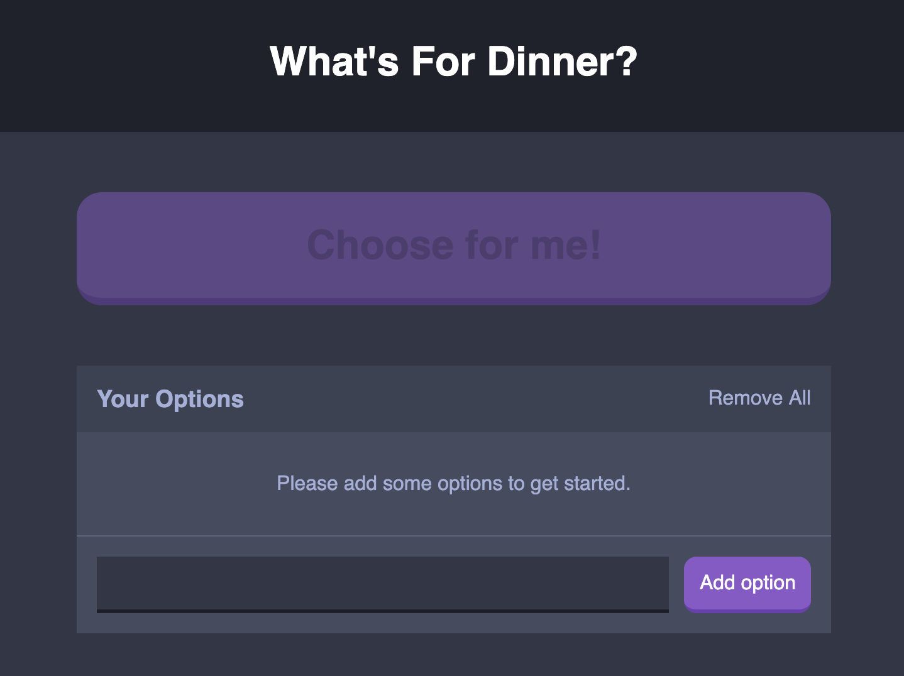

# What's for dinner?

Almost every day, my wife and I have this exact same question of what to do for dinner. So I decided to make this small web app to help us decide by randomly selecting one of the choices. 

Built with: 
  - React JS
  - SCSS

## Getting Started
  1. Install all dependencies
        ### npm install
  2. Fire up the server
        ### npm start

